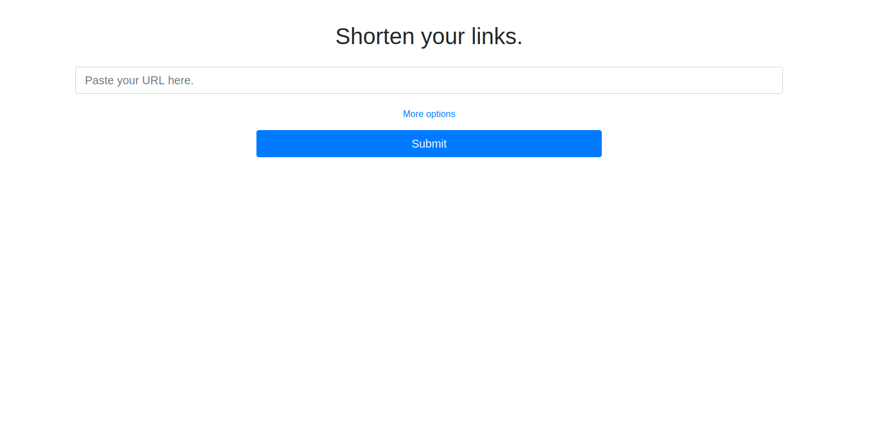
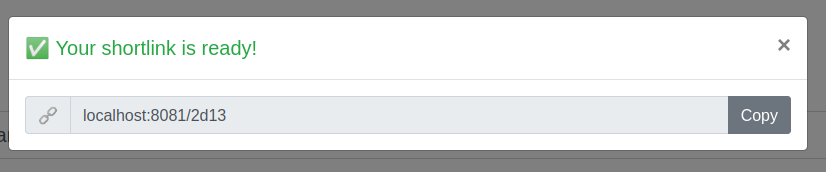
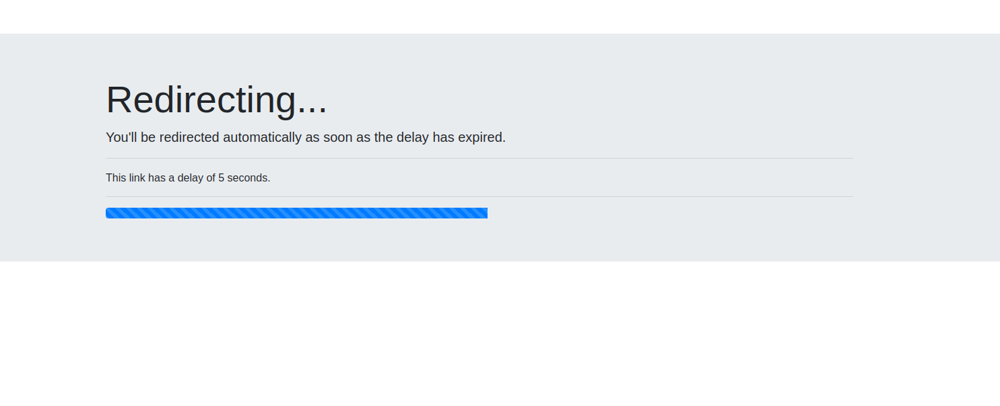

# Shortlink-System
### A minimalist, self-hosted URL-shortener service for managing shortlinks.

#### ⚠️ This is no longer used or maintained. Hence, ***I do not recommend using this in production!***
However, I created a [successor](https://github.com/fabiancdng/Shortinator) of this software that is far more secure and has many more features.

Please visit [https://github.com/fabiancdng/Shortinator](https://github.com/fabiancdng/Shortinator).

## Features
### Admin panel

### Optional delay before redirect

## Deployment
Although a Flask app comes with a built-in development server, you shouldn't use that in production.

A proper way to deploy a Flask app would, for instance, be [Apache and mod_wsgi](https://www.digitalocean.com/community/tutorials/how-to-deploy-a-flask-application-on-an-ubuntu-vps) or [standalone WSGI containers like Gunicorn or Gevent](https://flask.palletsprojects.com/en/2.0.x/deploying/wsgi-standalone/#gunicorn)